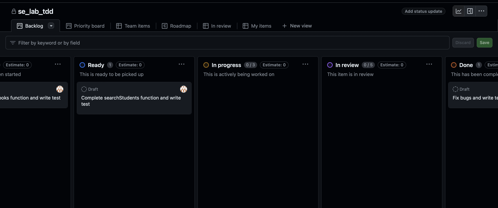
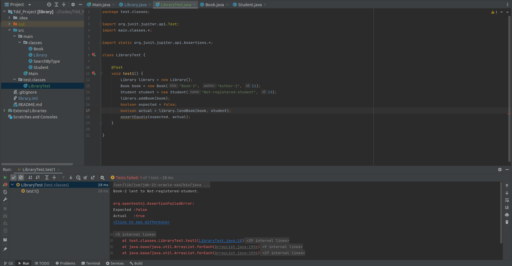
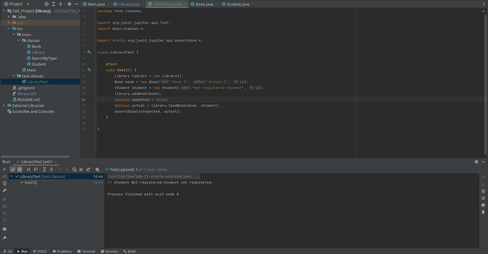
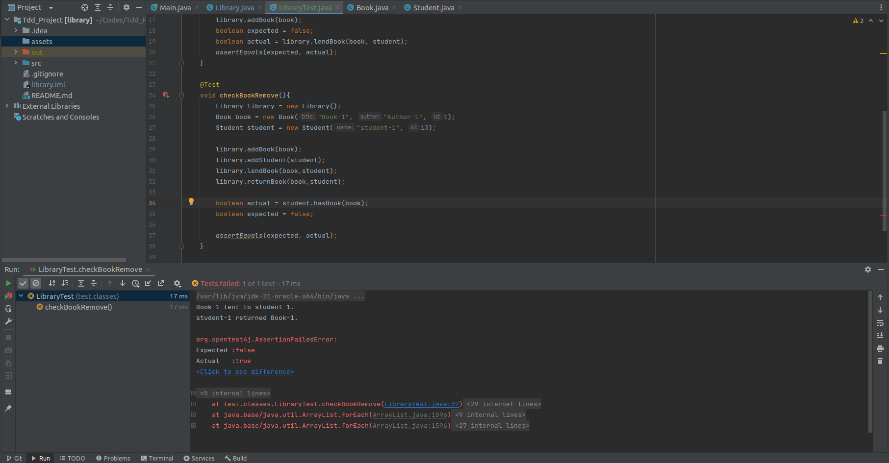
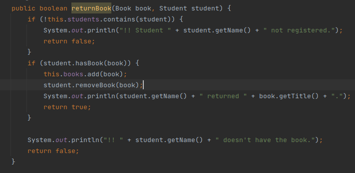
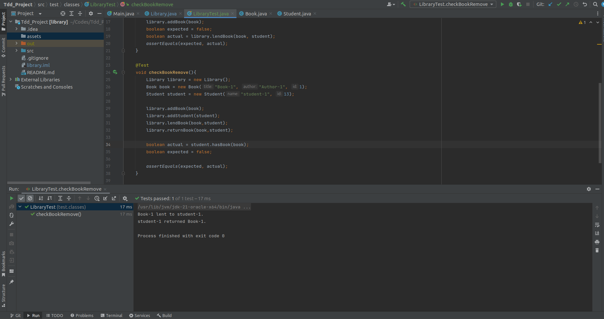

# TDD & Testing

## ایجاد بورد کانبان
مانند آزمایش قبلی، بورد کانبان پروژه ساخته شد. سپس کارها تقسیم شده و به افراد تیم اساین شدند:

### ایرادات پروژه:

+ هنگام قرض دادن کتاب به دانشجو، بررسی نمیشود که دانشجو ثبت شده است یا خیر!
+ پس از اینکه کتاب به کتابخانه برگردانده شد، از لیست کتاب های دانشجو حذف نمیشود!

## ایراد اول

همانطور که در شکل بالا مشخص است، انتظار داریم که کتاب قرض داده نشود و false برگردانده شود ولی شرط register شدن دانشجو
بررسی نشده و true برگردانده میشود.

در قطعه کد پیااده سازی شده، این مسئله حل شده و ثبت نام شدن دانشجو بررسی میشود.

در این شکل نیز مشخص است که تست pass شده و همه چیز درست کار میکند.

## ایراد دوم

همانطور که در شکل بالا مشخص است، انتظار داریم که دانشجو پس از برگرداندن کتاب دیگر آن کتاب را نداشته باشد ولی همچنان کتاب
را دارد.

در قطعه کد پیاده سازی شده کافیست متد removeBook را صدا کرده و آن کتاب را از لیست کتاب های دانشجو پاک کنیم.

در نهایت نیز میبینیم که تست pass شده است و کتاب از اختیار دانشجو خارج میشود.

## سوالات
  
۱- روش TDD برای پروژه‌هایی مفید است که نیازمندی‌های آن واضح و تقریبا ثابت است. برای مثال در پیاده‌سازی کتابخانه‌ها، API ها یا ماژول‌هایی که تعریف واضح و شفافی دارند استفاده از TDD می‌تواند سودمند باشد. همچنین در پروژه‌هایی که قابلیت نگهداری(maintainability) و صحت(correctness) اهمیت دارد می‌توان از TDD بهره برد.
روش سنتی نوشتن تست نیز می‌تواند در موارد مختلفی به کار گرفته شود. برای مثال در مواجهه با legacy code که استفاده از TDD ممکن نیست یا در پروژه‌‌ای که نیازمندی‌های آن در حال تکامل هستند و مدام تغییر می‌کنند بهتر است از روش سنتی استفاده شود. در پروژه‌های کوچک یا پروژه‌های کاوشی نیز بهتر است از روش سنتی استفاده شود.

۲- تیم ایجاد مسئول پیاده سازی کد است و همچنین اطمینان حاصل می‌کند این کد نیازمندی‌‌های نرم افزار را برطرف می‌کند. معمولا تیم ایجاد با تست‌های زیر سر و کار دارد:
- Unit Test: شامل تست کردن هر بخش کد به صورت جداگانه است. افراد تیم ایجاد با نوشتن unit test هر واحد و بخش کوچک از کد را تست می‌کنند.
- Integration Test: تمرکز این تست‌ها روی نحوه ارتباط درست بخش‌های مختلف کد است و چند بخش کد با یکدیگر تست می‌شوند.

تیم QA مسئول اطمینان یافتن از کیفیت نرم افزار است. این تیم برطرف شدن نیازمندی‌ها و رعایت استانداردها را بررسی می‌کند. معمولا تیم QA با تست‌های زیر سر و کار دارد:
- System Testing: شامل تست تمام سیستم است و هدف آن اطمینان یافتن از برطرف شدن نیازمندی‌ها می‌باشد.
- Regression Testing: تست کردن نرم افزار بعد از تغییرات یا بهبود‌های ایجاد شده یکی دیگر از انواع تست است که به آن Regression Testing می‌گویند تا اطمینان حاصل شود عملکرد سیستم دچار مشکل نشده است.

برخی از انواع تست‌ها با همکاری هر دو تیم انجام می‌شود. برای مثال در security testing هدف پیدا کردن آسیب پذیری‌های سیستم و خطرات احتمالی است. برای انجام این نوع از تست QA tester ها با افراد تیم ایجاد در تعامل هستند تا خطرات بالقوه را شناسایی کنند و اطمینان حاصل کنند که استانداردهای امنیتی در کد رعایت شده است. یکی دیگر از انواع تست performance testing است که شامل مواردی همچون load test و stress test می‌باشد. در این مورد نیز افراد دو تیم در تعامل با یکدیگر هستند تا آزمون‌های مربوطه انجام شود و قسمت‌هایی از کد که نیاز به بهبود و بهینه سازی دارند شناسایی شوند.
